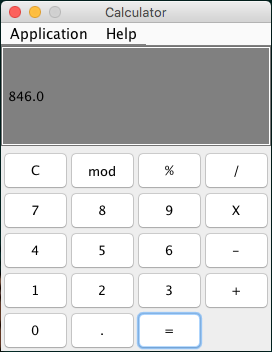

# Calculator

Implemented Java OOP design and allowed the ability to interact with the application via key presses or button clicks. This is an open source project, so please feel free to clone the repo and run the application locally.

**Functionalities:** 
- Standard Calculator Operations: (*, +, /, -, %)
- Input can be presented via keyboard or button clicks on the keypad
- Calculates sequence of operations

# Technologies Used:
- Java
- Swing Library
